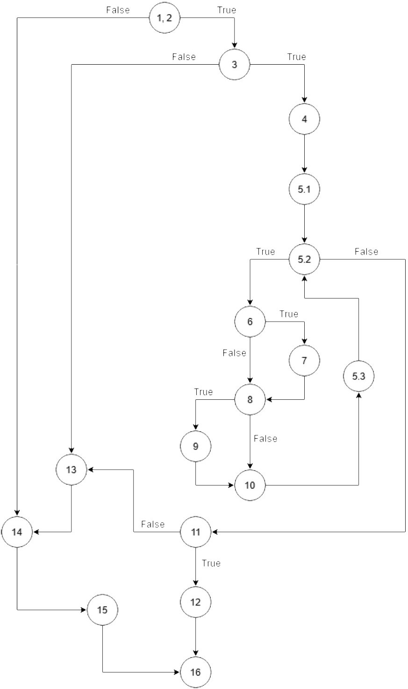

# **Втора лабораториска вежба по Софтверско инженерство**

## **Давид Тодоров, бр. на индекс 186021**

### **Група на код:**

Ја добив групата на код 1

### **Control Flow Graph**

 

### **Цикломатска комплексност**

Број на јазли: 17 

Број на ребра: 22

Цикломатска комплексност:
Ребра - Јазли + 2 = 22 - 17 + 2 = 7

Цикломатската комплексност e 7.

### **Тест случаи според критериумот  Every path**

**I) (1-2, 14, 15, 16)** 

user = null;
 
allUsers = empty List;

Претпоставка за излез: false;

**II) (1-2, 3, 13, 14, 15, 16)**

user = new User(username=null, password="whatever", email="whatever");

allUsers = празна листа;

Претпоставка за излез: false;

**III) (1-2, 3, 4, 5.1, 5.2, 11, 13, 14, 15, 16)**

user = new User(username=null, password="whatever", email=празен стринг);

allUsers = празна листа;

Претпоставка за излез: false;

**IV) (1-2, 3, 4, 5.1, 5.2, 11, 12, 16)**

Не е возможна оваа патека бидејќи никогаш не стигнува до јазлите 7 и 9 за условот во јазел 11 да биде исполнет.

**V) (1-2, 3, 4, 5.1, loop(5.2, 6, 8, 10, 5.3, 5.2), 11, 13, 14, 15, 16)**

user = new User(username="david", password="whatever", email="david$mail.com");

allUsers = празна листа;

Претпоставка за излез: false;

**VI) (1-2, 3, 4, 5.1, loop(5.2, 6, 8, 10, 5.3, 5.2), 11, 12, 16)**

Не е возможна оваа патека бидејќи никогаш не стигнува до јазлите 7 и 9 за условот во јазел 11 да биде исполнет.

**VII) (1-2, 3, 4, 5.1, loop(5.2, (6, 8) || (6, 7, 8), 10, 5.3, 5.2), 11, 13, 14, 15, 16)**

user = new User(username="david", password="whatever", email="david.mail@com")

allUsers = празна листа;

Претпоставка за излез: false;

**VIII) (1-2, 3, 4, 5.1, loop(5.2, (6, 8) || (6, 7, 8), 10, 5.3, 5.2), 11, 12, 16)**

Не е возможна оваа патека бидејќи никогаш не стигнува до јазелот 9 за условот во јазел 11 да биде исполнет.

**IX) (1-2, 3, 4, 5.1, loop(5.2, 6, (8, 10) || (8, 9, 10), 5.3, 5.2), 11, 13, 14, 15, 16)**

Не е возможна оваа патека бидејќи не може да стигне до јазелот 9 пред прво да стигне до јазелот 7.

**X) (1-2, 3, 4, 5.1, loop(5.2, 6, (8, 10) || (8, 9, 10), 5.3, 5.2), 11, 12, 16)**

Не е возможна оваа патека бидејќи никогаш не стигнува до јазлите 7 и 9 за условот во јазел 11 да биде исполнет.

**XI) (1-2, 3, 4, 5.1, loop(5.2, (6, 8) || (6, 7, 8), (8, 10) || (8, 9, 10), 5.3, 5.2), 11, 12, 16)** 

user = new User(username="david", password="whatever", email="david@mail.com");

allUsers = празна листа;

Претпоставка за излез: true;

**XII) (1-2, 3, 4, 5.1, loop(5.2, (6, 8) || (6, 7, 8), (8, 10) || (8, 9, 10), 5.3, 5.2), 11, 13, 14, 15, 16)**

Не е возможна оваа патека бидејќи кога ќе ги достигне јазлите 7 и 9, условот во јазел 11 станува исполнет и стигнуваме до јазелот 12 кој не носи директно до 16 пред воопшто да ги посетиме 13, 14 или 15.

### **Тест случаи според критериумот Multiple condition**

#### **Прв услов: if (user.getUsername()!=null && user.getEmail()!=null && !allUsers.contains(user.getUsername())))**

**-Исход 1: F && X && X**

user = new User(username=null, password="whatever", email="whatever");

allUsers = празна листа;

Претпоставка за излез: false

**-Исход 2: T && F && X**

user = new User(username="david", password="whatever", email=null);

allUsers = празна листа;

Претпоставка за излез: false
        
**-Исход 3: T && T && F**

user = new User(username="david, password="whatever", email="david@mail.com");

allUsers = { "david" };

Претпоставка за излез: false
        
**-Исход 4: T && T && T**

user = new User(username="david, password="whatever", email="david@mail.com");

allUsers = празна листа;

Претпоставка за излез: true

#### **Втор услов: if (atChar && user.getEmail().charAt(i)=='.')**

**-Исход 1: F && X**

user = new User(username="david, password="whatever", email="david$mail.com");

allUsers = празна листа;

Претпоставка за излез: false

**-Исход 2: T && F**

user = new User(username="david, password="whatever", email="david.mail@com");

allUsers = празна листа;

Претпоставка за излез: false

**-Исход 3: T && T**

user = new User(username="david, password="whatever", email="david@mail.com");

allUsers = празна листа;

Претпоставка за излез: true

#### **Трет услов: if (atChar && dotChar)** 

**-Исход 1: F && X**

user = new User(username="david, password="whatever", email="david$mail.com");

allUsers = празна листа;

Претпоставка за излез: false

**-Исход 2: T && F**

user = new User(username="david, password="whatever", email="david.mail@com");

allUsers = празна листа;

Претпоставка за излез: false

**-Исход 3: T && T**

user = new User(username="david, password="whatever", email="david@mail.com");

allUsers = празна листа;

Претпоставка за излез: true

### **Објаснување на напишаните unit tests**

#### *Every path*

**Со овој критериум на тестирање пробуваме да ги опфатиме сите патеки во Control Flow графот почнувајќи од почетниот јазел (1-2) и завршувајќи со некој од терминалните јазли (во случајов јазелот 16).**

I) Со овој тест проверуваме што би се случило доколку првиот услов во јазелот 2 не биде исполне и се движиме низ патеката (1-2, 14, 15, 16). Бидејќи никогаш не стигнуваме до јазлите 7 и 9, очекуваме дека крајниот исход ќе биде false.

II) Го проверуваме исходот кога вториот услов во јазел 3 не се исполнува и се движиме низ патеката (1-2, 3, 13, 14, 15, 16). И овде не стигнуваме до 7 и 9, па затоа крајниот исход претпоставуваме дека ќе биде false.

III) Проверуваме што би се случило кога програмот никогаш не влегува во for-циклусот. Бидејќи тој итерира низ карактерите на емаилот на корисникот, единствен начин тоа да се постигне е доколку емаилот е празен стринг. Патеката која ја минеме е (1-2, 3, 4, 5.1, 5.2, 11, 13, 14, 15, 16). Бидејќи јазлите 7 и 9 се во рамки на for-циклусот, до нив никогаш не се стигнува и крајниот резултат мора да биде false.

IV) Патеката (1-2, 3, 4, 5.1, 5.2, 11, 12, 16) не е возможна бидејќи условот во јазел никогаш не може да биде исполнет без да се влезе во јазлите 7 и 9 па затоа никогаш не може да се стигне до јазелот 12.

V) Со овој тест проверуваме случај кога во емаилот не е исполнет критериумот дека треба да има специјален знак '@', па по него знак '.'. Патеката која ја поминуваме е (1-2, 3, 4, 5.1, loop(5.2, 6, 8, 10, 5.3, 5.2), 11, 13, 14, 15, 16). Крајната претпоставка за исход со невалиден емаил е false.

VI) Не е возможна патеката (1-2, 3, 4, 5.1, loop(5.2, 6, 8, 10, 5.3, 5.2), 11, 12, 16), бидејќи никогаш не стигнува до јазлите 7 и 9 за условот во јазел 11 да биде исполнет па да може да се стигне до 12.

VII) Патеката во овој тест случај е (1-2, 3, 4, 5.1, loop(5.2, (6, 8) || (6, 7, 8), 10, 5.3, 5.2), 11, 13, 14, 15, 16). Проверуваме случај кога во емаилот ги има и двата потребни специјални знаци, но не во бараниот редослед. Бидејќи вториот услов на јазел 8 во for-циклусот не е исполнет, никогаш не стигнуваме до јазел 9, па затоа ни паѓа условот во јазел 11 и функцијата треба да врати false.

VIII) Патеката (1-2, 3, 4, 5.1, loop(5.2, (6, 8) || (6, 7, 8), 10, 5.3, 5.2), 11, 12, 16) не е возможна бидејќи без да влеземе во јазел 9 не може условот во 11 да биде исполнет за програмата да врати true во 12.

IX) Патеката (1-2, 3, 4, 5.1, loop(5.2, 6, (8, 10) || (8, 9, 10), 5.3, 5.2), 11, 13, 14, 15, 16) не е возможна бидејќи не може прво да се стигне до јазел 9 пред претходно да биде поминат јазелот 7.

X) Патеката (1-2, 3, 4, 5.1, loop(5.2, 6, (8, 10) || (8, 9, 10), 5.3, 5.2), 11, 12, 16) не е возможна бидејќи никогаш не стигнува до јазлите 7 и 9 за условот во јазел 11 да биде исполнет.

XI) Со овој тест случај бидејќи емаилот е валиден, функцијата стигнува до јазлите 7 и 9, па условот во 11 е исполнет и крајниот исход е true. Изодената патека е (1-2, 3, 4, 5.1, loop(5.2, (6, 8) || (6, 7, 8), (8, 10) || (8, 9, 10), 5.3, 5.2), 11, 12, 16).

XII) Патеката (1-2, 3, 4, 5.1, loop(5.2, (6, 8) || (6, 7, 8), (8, 10) || (8, 9, 10), 5.3, 5.2), 11, 13, 14, 15, 16) не е возможна бидејќи сите услови за емаилот се исполнети, па условот во јазел 11 не може да падне туку ќе продолжи до 12 и ќе терминира функцијата со исход true.

#### *Multiple condition*

**Со овој критериум на тестирање ги разгледуваме само if-условите во кои се опфатени повеќе помали изрази одвоени со некој од логичките оператори && или ||.
За време на извршување, доколку повеќе изрази се одвоени со && тогаш тие се проверуваат се додека не се налета на израз кој враќа false или додека не се исцрпат сите изрази во if-условот. Од друга страна, доколку изразите се одделени со ||, runtime околината ги проверува условите се додека не стигне до израз кој враќа true или додека не се поминат сите изрази.**

*(Во исходите знакот X ни означува дека вредноста на негово место (true или false) нема никакво влијание на резултатот на изразот.)*

##### Прв услов: if (user.getUsername()!=null && user.getEmail()!=null && !allUsers.contains(user.getUsername())))

Исход 1: (false && X && X) = false

Исход 2: (true && false && X) = false        

Исход 3: (true && true && false) = false
        
Исход 4: (true && true && true) = true

##### Втор услов: if (atChar && user.getEmail().charAt(i)=='.')

Исход 1: (false && X) = false

Исход 2: (true && false) = false

Исход 3: (true && true) = true

##### Трет услов: if (atChar && dotChar)
 
Исход 1: (false && X) = false

Исход 2: (true && false) = false

Исход 3: (true && true) = true
